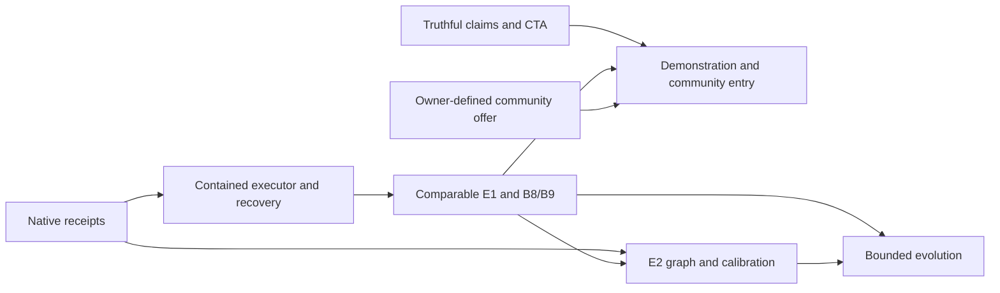

# Harness reliability, public demonstration and community conversion

Date: 2026-09-22. Status: **research complete; integration proposal for owner review**. This document is the requested planning deliverable, not a claim that its features are implemented or that a new Scout implementation routine has passed its plan gate.

## Direction and scope

The owner confirmed during this research:

- Next 4–6 weeks: a reliable harness and a public demonstration.
- Primary audience: developers who want to use agents better.
- Main landing conversion: buy access or join the community.
- Community's main delivery: a library of skills, templates and tutorials.
- First demonstration: Claude and Codex together; neither host is optional for that milestone.

The confirmed answers and remaining delivery inputs are recorded in [decisions.md](decisions.md). The order below preserves [ADR 0006](../../adr/0006-evaluation-first-evolution.md): trustworthy evaluation before commercial expansion or evolutionary optimization. Improving the truthfulness of the existing public page can happen immediately; payment implementation does not replace the technical milestone.

Success means a developer can inspect and reproduce an engineering case, see which execution and quality checks passed, understand the measured consumption and its gaps, and reach a real community entry path. Neither a green process nor a copied command counts as that outcome. Publication and production configuration remain separate actions from preparing and validating the changes locally.

Sources, limitations and audit findings are in [dossier.md](dossier.md); the local research observations are in [evidence.json](evidence.json). This umbrella plan coordinates the existing [T13 plan](../../t13/PLAN.md), [eval plan](../../evals/PLAN.md) and [commercial specification](../../commercial/spec.md); it does not silently replace their contracts.

## Verified starting point

Baseline inspected: clean `master`, `8e6c20ee9952e5f1314f9ba19b28296280b41f05`. The branch was two commits ahead and two behind the existing `origin/master` reference. No merge, stash application or remote publication occurred during research.

| Area | Delivered evidence | Remaining work |
|---|---|---|
| T1 / E1 | Parity fixes, separate execution/task/control outcomes, adversarial fixtures, provenance and qualified comparisons | A live isolated control; reconciliation of eval telemetry with complete receipts |
| T13 S1/S2 | Manual envelope/menu and capability routing | Host-specific enforcement evidence; routing is not execution |
| T13 S3 | SQLite ledger, Claude receipt parser, pinned worktrees, scope audits and simulated driver | Native executor, attributable descendant usage and containment for every role |
| Process isolation | Docker fixed-process probe passed 12/12 on September 21 | Agent/tool calls have not been connected to that profile |
| T13 S4 | Scoped review history and local hooks | Native hook delivery evidence; shell writes are outside edit-hook coverage |
| E2 / evolution | Accepted graph/calibration direction and restricted search space | Fixtures, empirical calibration, held-out evaluation and promotion evidence |
| Landing/community | Static public page, PT/EN, graph/library and visual checks | Accurate proof, reliable CTA, real membership flow; no Supabase/Asaas implementation |

The **September 21** complete battery passed 92/92 Python tests with zero skips, both visual methods, Node 5/6/7 scenarios plus portal checks, eval selftest, install checks and graph checks. It was not rerun as part of this documentation research. Historical evals remain four invalid and four unverified records: **no certified comparative baseline**. The historical 1,311,288-token / US$2.857086 client-estimated subtotal is not this research session's usage or authoritative billing.

Current research also checked CLI `0.155.0-alpha.9.2` and successfully generated its App Server schema locally. A token-usage notification schema exists; schema availability does not establish delivery, descendant coverage or billing. Ordinary native Codex/Astra collaboration is already authorised; these missing proofs limit benchmark claims, not routine work.

## Proposed integration sequence

Calendar allocation below is a planning hypothesis for the owner's 4–6-week objective. Advance by acceptance, not elapsed time. Each implementation slice starts with a failing boundary check where behavior changes and ends with the complete `scripts/check.ps1` battery, zero skips. Use existing modules and the standard library before adding a framework.

| Slice | Suggested window | Deliverable and seams | Acceptance / dependency |
|---|---|---|---|
| P0 — truthful public evidence | Week 1 | Reconcile `PRODUCT.md`, `docs/benchmarks.md`, current handoff summaries and landing claims. Fix clipboard success/error handling. Extend the current `site/showcase/v3/metrics.json` → `scripts/site_build.py` pipeline with qualified evidence rather than create a second metrics source. | Invalid/unverified history cannot render a certified PASS. Clipboard rejection reports failure and offers manual copying; successful copying is verified. Change `site/index.html` and regenerate `site/public/index.html`. |
| P1 — native usage contract | Weeks 1–2 | One versioned receipt contract in `harness/`, consumed by `evals/records.py`; two bounded adapters: Codex App Server events and the existing Claude receipt path. | On each host, parent + two children + reviewer + retry count exactly once. Test duplicate/replayed/cumulative events, missing child evidence, resume and cancellation. Missing dollars stay null; ordinary native allowance work remains authorised. |
| P2 — contained executor and recovery | Weeks 2–3 | Reuse `swarm_worktrees.py` and extract the tested Docker profile from `sandbox_probe.py` into a narrow execution boundary. Persist coordinator transitions using existing SQLite. Bind artifacts, attempts and source hashes. | For both Claude and Codex, implementer/integrator/reviewer have host-captured boundary evidence. Kill/restart at reserve/start/result/integrate boundaries; no duplicate dispatch of unknown attempts or double integration. Sentinels, source/sibling paths, ledger and graders remain protected. Depends on P1. |
| P3 — E1 controls and B8/B9 | Weeks 3–4 | Connect `evals/run.py` to reproducible harness/control environments for Claude and Codex; implement sequential/swarm and authority/isolation cases. Add evaluator-tampering fixtures. | Common case/base/grader corpus; fixed model/settings/resources within each host's compared arms and explicit intentional differences. Independent grading, hard failures, no answer-key leakage. Separate validity/quality/coverage/reliability and per-host evidence. Depends on P1/P2. |
| P4 — E2 offline graph and calibration | Start in parallel with P1; calibrate after P3 | Frozen engineering task DAG, attempt ledger, bounded weights and planted refuter cases. Integrate actual events only after P1. | Invariant tests below pass; human labels and disagreements recorded. No coefficients described as calibrated before adjudication. Live resource efficiency depends on P3. |
| P5 — public demonstration and community journey | Weeks 4–6, after relevant acceptance | Reproducible engineering cases on Claude and Codex; developer-focused landing offering the skills/templates/tutorial library, with community entry primary and evidence secondary. | Fresh-install walkthrough and accepted delivery on both hosts linked to commit, commands and qualified receipt. Public proof excludes private traces. Community CTA completes its stated transaction; checkout only after entitlement/webhook tests and an actual offer. Depends on P0/P3 and pricing/access details. |
| P6 — bounded evolution | After P3/P4; not promised within 4–6 weeks | Fixed vs random vs genetic search; evaluate GEPA as an optional experiment adapter. | Same total resource budget, frozen graders, disjoint holdout, unsuccessful candidates charged, human approval before promotion. No rewrite of authority, sandbox or evaluator. |

If the native executor cannot provide complete tool containment or descendant usage, publish the exact narrower capability demonstrated and its missing fields. Do not silently substitute an externally billed provider, claim Docker containment for host tools, or mark the milestone complete. A provider bridge such as Inspect remains an optional experiment requiring a compatible execution channel; its configured provider proxy has not been shown to preserve the existing Astra allowance.

The owner's two-host choice increases the first milestone's scope. Develop the adapters in parallel after fixing the shared contract, then run the same acceptance corpus on each. First investigate the actual Claude execution channel and supported containment on this Windows host; its native sandbox support is not equivalent to Docker tool routing. Do not assume Claude billing/credentials from the owner's Codex allowance statement. Compare harness versus control within each matched host/model/configuration; cross-host results are stratified, not an unqualified model ranking. If one host is incomplete, report partial progress and keep joint certification open. Hermes remains later parity work.

## Integration contracts and immediate technical work

### One evidence path

Proposed flow: host events → coordinator-owned canonical receipt → E1 result → E2 task/attempt aggregation → sanitised public evidence. Optional ATIF/OTel exports are views of that record, not competing accounting databases.

The receipt should retain run/task/attempt/role/provider/session/thread/turn identifiers, parent links, event identity, timestamps, model and adapter version, process state, raw source hash, usage availability and coverage. Keep reported token categories, estimated money and billed money distinct. Schema defaults are not observations; a missing field with a default of zero must not silently become measured zero.

Normalize each provider using verified inclusion rules. Cache and reasoning categories may already be subsets of input/output totals; never add all numeric fields blindly. Cumulative updates require deduplication and reset/resume handling. Do not add parent aggregates to child totals unless their disjointness is established. Failures, refuters, integrators, retries and abandoned candidates belong in the resource account.

There is a concrete seam to fix before B8/B9: `evals/records.py:telemetry()` currently consumes top-level Claude `usage` and labels available `total_cost_usd` as measured; the newer swarm receipt uses whole-tree evidence and identifies client estimates. Change the contract and comparator together, add fixtures and derive new records with provenance. Preserve historical originals and their invalid/unverified status.

### Execution, recovery and control integrity

The current experimental JS driver expects injected host APIs; their names are not verified native capabilities. Implement against the actual installed host interface. Capability checks should name what is supported: telemetry, descendants, tool sandboxing, network restrictions, cancellation, provider caps and billing provenance. Authority to run, evidence of usage, and proof of isolation are separate dimensions.

Use the current worktree manager for disjoint scopes and a frozen base SHA. The coordinator owns state, manifests and integration. Persist a launch intent before execution, correlate the resulting provider identity, and leave ambiguous launches pending reconciliation. Checkpointing is useful only if restart cannot repeat side effects or release an unknown running attempt as free budget. Inspect all roles; the present workflow's strongest scope check is on implementers.

Extend E1 defenses from empty/error outputs to a worker trying to change a grader, create a deceptive test hook, forge a result artifact, replay another attempt's receipt, read a gold answer or inject instructions into a refuter's evidence. Protected grading and independent artifact verification must reject these cases. Also keep positive controls: an evaluator that rejects everything is broken. This is an application of the benchmark-audit literature, not a claim that these additional attacks were already tested here.

### E2 metrics that resist graph manipulation

Use two linked structures: a reference DAG of requirements frozen before execution, and an append-only graph of observed attempts. Dynamic replanning can change the latter; changing the former requires an explicit versioned task revision, not extra credit.

- Quality: score accepted evidence against fixed requirements. As an experimental family, use `w_i = epsilon/n + (1-epsilon) * r_i/sum(r)`, with `0 < epsilon < 1`, positive `r_i` derived from agreed importance and capped normalized centrality. This provides a floor `epsilon/n`; topology/coefficients are versioned and remain uncalibrated proposals. Critical requirements are eliminatory before any aggregate quality score.
- Reliability: valid executions and accepted tasks each have their own rate. Retain attempted runs in the relevant denominator; distinguish infrastructure failure, invalid evidence and task failure.
- Time: report end-to-end elapsed time, critical-path duration, active execution, summed agent time, queue time and human waiting separately. Parallelism can reduce elapsed time while increasing total work.
- Resources: raw provider categories, deduplicated total where valid, coverage, estimates and billed values. Account limits or remaining allowance percentages are not per-task consumption.
- Loops: extra attempts earn no requirement weight. Classify waste only when there is no new accepted evidence, artifact change or justified verification; retries after environment failure and purposeful verification remain distinguishable. Store the reason for any penalty.
- Refuters: planted real issues, clean examples and near misses; precision/recall, false positives/negatives and human disagreement. Finding volume and consensus alone are not ground truth.

Mandatory fixtures: artificial task splitting cannot improve quality; a critical failure cannot be compensated; duplicate events cannot inflate consumption; successful retries retain prior cost; two parallel nodes do not turn summed time into elapsed time; a legitimate verification is not penalized as a useless loop. Prefer a quality/reliability/resource frontier over a single opaque score. For optimization, provisionally minimize resources subject to accepted quality and hard constraints; the owner/human calibration must ratify the thresholds.

### Evolution without moving the target

Keep the approved genome small: Gauntlet lenses/subagents, effort per reference node and fallback policy. Archive candidate configuration, parentage, seed, artifacts, outcomes and full search consumption. Compare fixed, random and genetic strategies using the same task partitions and total budgets, including proposer/reflection overhead. Fix sample counts and stopping rules before observing outcomes; report variation and failures rather than the best run alone.

GEPA and Meta-Harness supply useful search/archive patterns. Neither establishes a gain on this repository. Broad source-code self-rewriting and model-weight training remain outside the approved initial search space. Human review promotes a candidate only after held-out evaluation, regression/isolation checks and reproducible evidence; retain the last accepted configuration for rollback.

## Landing and community conversion

### Correctness first

The public page still calls historical B5 control valid and displays outdated PASS/cost narratives. The source is `site/index.html`; `site/public/index.html` is generated, not an independently maintained landing. The build already injects showcase metrics, so P0 must update that source of truth as well as surrounding prose. Preserve historical evidence with explicit qualification.

The build's current `main()` reads `site/showcase/v3/metrics.json`; its docstring still mentions `site/showcase/06-metrics.json`. Correct that stale description during P0. The older file is historical evidence, not the current injection source; preserve it and qualify its interpretation in the derived documentation/page.

The current copy handler reports success on rejected clipboard writes; the visual test checks the label only. Add success and rejection tests, including the actual command or a usable manual-copy fallback. Native hook configuration must be described separately from observed hook delivery; the earlier parity finding remains relevant.

### Proposed developer journey

1. Hero: audience, concrete engineering outcome, community CTA and visible evidence link. Suggested direction: **“Use agentes para entregar código verificável.”** Supporting copy: **“Uma biblioteca de skills, templates e tutoriais para desenvolvedores, com exemplos reproduzíveis em Claude e Codex.”** The two-host proof must exist before that copy is published as a delivered capability. Do not imply mentoring or guided challenges are included.
2. One short demonstration: task → test failure → scoped work → independently checked result → honest time/token receipt. Clearly distinguish recorded demo, offline fixture and live comparative benchmark.
3. Community offer: who it serves, included delivery, onboarding, cadence, support boundaries, prerequisites and what is free versus paid. Show real authorship. Current author placeholders must be replaced with owner-supplied facts.
4. Proof and scope: shipped / experimental / planned capabilities; dated host coverage and reproducibility links. No unverified exclusivity, guaranteed savings, testimonials or member counts.
5. A repeated primary community CTA and a secondary technical path. Move the complete graph, long version history and reference library to secondary exploration without losing existing content.

Make the library valuable through curation and verification: organize by developer job, publish a complete free sample, show prerequisites and host compatibility per item, and include version/date, expected artifact, reproducible verification and a troubleshooting path. Mark unverified templates explicitly. State what is already open source versus what membership adds; do not sell a claim of exclusive ownership over publicly available skills. A guided sample tutorial can demonstrate value without committing the community to live mentoring.

The measured mobile page is 19,979 px high at 390×844; installation copy begins at y=888 and the guide at y=967. This supports testing a clearer first-screen path, **not a measured conversion-loss claim**. Preserve PT/EN, themes, reduced motion and the existing visual identity. Audit keyboard/focus return, drawer behavior, error states and mobile flow; add canonical/OG metadata, lazy-load nonessential graph/media where useful and measure field/lab performance separately.

### Membership slice and measurement

Supabase Auth/RLS and Asaas checkout are existing product choices, not new selections by this research. If membership is paid, the minimum real flow includes sign-in, an identified offer, checkout, verified/idempotent webhooks, server-side entitlement, denied access without membership, and cancellation/refund state handling. Never embed protected guides in public HTML or grant access on a browser redirect alone. Owner-supplied account configuration, prices, author facts and delivery cadence are inputs; implement and test the flow locally before any production decision.

If the community is not ready to sell, the interim CTA should explicitly say participation request/pilot interest with a functioning confirmation, rather than pretend there is a checkout. This is a fallback proposal, not an inferred change to the owner's commercial objective.

Record a small funnel: eligible landing visit → community CTA → completed entry request or signup → checkout started/confirmed when applicable → first library tutorial/template successfully applied. Distinguish clicks from completion and purchase from activation. Keep denominators, failure/abandonment states, language/device/source and exclusion of internal tests/bots. Collect minimal analytics without prompts, private code or raw agent traces. No analytics vendor was installed or chosen here.

With low traffic, begin with observed developer usability sessions and first-task completion; choose quantitative A/B sample size from actual baseline and the minimum effect of interest. Do not promise conversion uplift. Monitor paid membership activation and support burden alongside checkout conversion, so marketing is not rewarded for selling an undeliverable experience.

## Five pillars and deferred work

| Pillar | First useful connection | Later dependency |
|---|---|---|
| Engineering | Versioned bug-fix/refactoring and TDD cases | Broader language/repository coverage after comparable evidence |
| Swarms / OS | Trusted executor, receipt viewer, visible run state | GOAP-style replanning and command-centre UI after durable state; no new OS framework selected |
| Thesis Factory | Reproduce a public engineering experiment with pinned data/code/environment | Scientific protocols, mathematical checks and academic writing after engineering reference evals; do not broaden `thesis-review` silently |
| Educational community | Curated skills/templates/tutorial library with tested examples and per-host compatibility | Classroom, code-verified challenges and member progression are later additions, not included mentoring promises |
| Agentic marketing | Case-study/tutorial drafts from accepted commits and sanitized evidence | Campaigns and distribution after truthful proof and a real offer; external sending/publication needs its own authority |

Keep remote Phase C/screen-control plans downstream. Existing remote documentation is not a delivered skill. Avoid a framework rewrite, buying observability, importing every new skill, model-weight optimization, or unrestricted self-modifying evaluators in this slice. Optional dependencies go through the existing intake/license/review process only if selected for implementation.

## Maintenance and handoff

At each relevant release or planned research review, compare upstream pinned versions and API contracts against the source register; rerun affected conformance fixtures before upgrading. Propose capability-graph edges only when a tool has a concrete selected role; discovery alone is not installation. No recurring automation was created by this plan.

Update [T13-H1](../../t13/TICKET-HANDOFF-CLAUDE.md) at each handoff with baseline SHA, files, exact commands, counts/skips, real versus simulated evidence and the next acceptance boundary. Keep source/usage evidence sanitized and avoid tracked credentials or private transcripts. Reviewed local commits are authorised; report the resulting SHA and preserve unrelated changes. Do not push or rewrite shared history as part of this plan.

**Recommended next implementation slice after direction review:** P0 plus the offline receipt contract/fixtures in P1, with E2 fixture design in a disjoint scope. Do not call the native executor certified until P2/P3 produce the missing evidence.
