# Skills graph (2026-09-14)

Generated by `skills_graph.py build`; do not edit. Installed nodes are all shown; catalog and remote nodes only when an edge touches them. Rings: catalog 403, installed 83, remote 4. Edges: 90 (61 parsed `calls`). Remote snapshot: 2026-09-14.

```mermaid
flowchart LR
  subgraph installed["installed"]
    n_ask_matt["ask-matt"]
    n_automate["automate"]
    n_autopilot["autopilot"]
    n_canvas["canvas"]
    n_claude_handoff["claude-handoff"]
    n_code_review["code-review"]
    n_codebase_design["codebase-design"]
    n_create_hook["create-hook"]
    n_create_rule["create-rule"]
    n_create_skill["create-skill"]
    n_create_subagent["create-subagent"]
    n_deploy_with_vercel["deploy-with-vercel"]
    n_detour["detour"]
    n_diagnosing_bugs["diagnosing-bugs"]
    n_domain_modeling["domain-modeling"]
    n_gauntlet_loop["gauntlet-loop"]
    n_git_guardrails_claude_code["git-guardrails-claude-code"]
    n_goal["goal"]
    n_graphify["graphify"]
    n_grill_me["grill-me"]
    n_grill_with_docs["grill-with-docs"]
    n_grilling["grilling"]
    n_handoff["handoff"]
    n_higgsfield_brandkit["higgsfield-brandkit"]
    n_higgsfield_generate["higgsfield-generate"]
    n_higgsfield_marketplace_cards["higgsfield-marketplace-cards"]
    n_higgsfield_product_photoshoot["higgsfield-product-photoshoot"]
    n_higgsfield_soul_id["higgsfield-soul-id"]
    n_higgsfield_video_explainer["higgsfield-video-explainer"]
    n_higgsfield_websites["higgsfield-websites"]
    n_higgsfield_youtube_thumbnail["higgsfield-youtube-thumbnail"]
    n_impeccable["impeccable"]
    n_implement["implement"]
    n_improve_codebase_architecture["improve-codebase-architecture"]
    n_loop["loop"]
    n_loop_me["loop-me"]
    n_migrate_to_shoehorn["migrate-to-shoehorn"]
    n_migrate_to_skills["migrate-to-skills"]
    n_new_repo["new-repo"]
    n_omniharness["omniharness"]
    n_onboard["onboard"]
    n_origin["origin"]
    n_ponytail["ponytail"]
    n_ponytail_audit["ponytail-audit"]
    n_ponytail_debt["ponytail-debt"]
    n_ponytail_gain["ponytail-gain"]
    n_ponytail_help["ponytail-help"]
    n_ponytail_review["ponytail-review"]
    n_prototype["prototype"]
    n_rename_chat["rename-chat"]
    n_research["research"]
    n_resolving_merge_conflicts["resolving-merge-conflicts"]
    n_review["review"]
    n_review_bugbot["review-bugbot"]
    n_review_security["review-security"]
    n_scaffold_exercises["scaffold-exercises"]
    n_scout["scout"]
    n_sdk["sdk"]
    n_setup_matt_pocock_skills["setup-matt-pocock-skills"]
    n_setup_pre_commit["setup-pre-commit"]
    n_setup_ts_deep_modules["setup-ts-deep-modules"]
    n_share["share"]
    n_shell["shell"]
    n_skill_installer["skill-installer"]
    n_skills_graph["skills-graph"]
    n_split_to_prs["split-to-prs"]
    n_statusline["statusline"]
    n_tdd["tdd"]
    n_teach["teach"]
    n_thesis_review["thesis-review"]
    n_to_questionnaire["to-questionnaire"]
    n_to_spec["to-spec"]
    n_to_tickets["to-tickets"]
    n_triage["triage"]
    n_update_cli_config["update-cli-config"]
    n_update_cursor_settings["update-cursor-settings"]
    n_wait_what["wait-what"]
    n_wayfinder["wayfinder"]
    n_wizard["wizard"]
    n_writing_beats["writing-beats"]
    n_writing_for_agents["writing-for-agents"]
    n_writing_fragments["writing-fragments"]
    n_writing_shape["writing-shape"]
  end
  subgraph catalog["catalog: 9 of 403 linked"]
    n_abi_screenshot_to_code["abi/screenshot-to-code"]
    n_bradautomates_claude_video["bradautomates/claude-video"]
    n_calesthio_openmontage["calesthio/openmontage"]
    n_firecrawl["firecrawl"]
    n_frontend_design["frontend-design"]
    n_magic_mcp["magic-mcp"]
    n_tt_a1i_archify["tt-a1i/archify"]
    n_unclecode_crawl4ai["unclecode/crawl4ai"]
    n_video_db_skills["video-db/skills"]
  end
  subgraph remote["remote: 1 of 4 linked"]
    n_nateherkai_scroll_craft["nateherkai/scroll-craft"]
  end
  n_scout -->|calls| n_detour
  n_scout -->|calls| n_grilling
  n_scout -->|calls| n_to_spec
  n_goal -->|calls| n_loop
  n_review -->|calls| n_review_bugbot
  n_review -->|calls| n_review_security
  n_review_bugbot -->|calls| n_review
  n_review_security -->|calls| n_review
  n_ask_matt -->|calls| n_code_review
  n_ask_matt -->|calls| n_codebase_design
  n_ask_matt -->|calls| n_diagnosing_bugs
  n_ask_matt -->|calls| n_domain_modeling
  n_ask_matt -->|calls| n_grill_me
  n_ask_matt -->|calls| n_grill_with_docs
  n_ask_matt -->|calls| n_grilling
  n_ask_matt -->|calls| n_handoff
  n_ask_matt -->|calls| n_implement
  n_ask_matt -->|calls| n_improve_codebase_architecture
  n_ask_matt -->|calls| n_prototype
  n_ask_matt -->|calls| n_research
  n_ask_matt -->|calls| n_resolving_merge_conflicts
  n_ask_matt -->|calls| n_setup_matt_pocock_skills
  n_ask_matt -->|calls| n_tdd
  n_ask_matt -->|calls| n_teach
  n_ask_matt -->|calls| n_to_questionnaire
  n_ask_matt -->|calls| n_to_spec
  n_ask_matt -->|calls| n_to_tickets
  n_ask_matt -->|calls| n_triage
  n_ask_matt -->|calls| n_wait_what
  n_ask_matt -->|calls| n_wayfinder
  n_ask_matt -->|calls| n_wizard
  n_ask_matt -->|calls| n_writing_for_agents
  n_code_review -->|calls| n_setup_matt_pocock_skills
  n_grill_with_docs -->|calls| n_domain_modeling
  n_grill_with_docs -->|calls| n_grilling
  n_implement -->|calls| n_code_review
  n_implement -->|calls| n_tdd
  n_improve_codebase_architecture -->|calls| n_codebase_design
  n_improve_codebase_architecture -->|calls| n_domain_modeling
  n_improve_codebase_architecture -->|calls| n_grilling
  n_tdd -->|calls| n_codebase_design
  n_to_spec -->|calls| n_setup_matt_pocock_skills
  n_to_tickets -->|calls| n_setup_matt_pocock_skills
  n_triage -->|calls| n_domain_modeling
  n_triage -->|calls| n_grilling
  n_triage -->|calls| n_setup_matt_pocock_skills
  n_wayfinder -->|calls| n_domain_modeling
  n_wayfinder -->|calls| n_grilling
  n_wayfinder -->|calls| n_prototype
  n_wayfinder -->|calls| n_research
  n_wayfinder -->|calls| n_setup_matt_pocock_skills
  n_loop_me -->|calls| n_grilling
  n_setup_ts_deep_modules -->|calls| n_codebase_design
  n_grill_me -->|calls| n_grilling
  n_ponytail_gain -->|calls| n_ponytail_audit
  n_ponytail_gain -->|calls| n_ponytail_debt
  n_ponytail_help -->|calls| n_ponytail
  n_ponytail_help -->|calls| n_ponytail_audit
  n_ponytail_help -->|calls| n_ponytail_debt
  n_ponytail_help -->|calls| n_ponytail_gain
  n_ponytail_help -->|calls| n_ponytail_review
  n_impeccable -->|precedes| n_magic_mcp
  n_magic_mcp -->|guided-by| n_impeccable
  n_magic_mcp -->|feeds| n_ponytail_review
  n_frontend_design -.->|alternative-to| n_impeccable
  n_grilling -->|precedes| n_to_spec
  n_to_spec -->|precedes| n_to_tickets
  n_research -->|feeds| n_grilling
  n_code_review -.->|alternative-to| n_ponytail_review
  n_grill_me -.->|alternative-to| n_grill_with_docs
  n_higgsfield_marketplace_cards -.->|alternative-to| n_higgsfield_product_photoshoot
  n_ponytail_review -.->|alternative-to| n_ponytail_audit
  n_gauntlet_loop -->|feeds| n_gauntlet_loop
  n_omniharness -->|precedes| n_skills_graph
  n_skills_graph -->|feeds| n_scout
  n_scout -->|precedes| n_grilling
  n_scout -->|feeds| n_to_spec
  n_detour -->|feeds| n_scout
  n_wayfinder -.->|alternative-to| n_scout
  n_scout -->|feeds| n_skill_installer
  n_skill_installer -->|feeds| n_skills_graph
  n_unclecode_crawl4ai -->|feeds| n_scout
  n_unclecode_crawl4ai -.->|alternative-to| n_firecrawl
  n_bradautomates_claude_video -.->|alternative-to| n_video_db_skills
  n_abi_screenshot_to_code -.->|alternative-to| n_frontend_design
  n_tt_a1i_archify -.->|candidate-for| n_domain_modeling
  n_calesthio_openmontage -.->|alternative-to| n_higgsfield_video_explainer
  n_nateherkai_scroll_craft -.->|candidate-for| n_scout
  n_impeccable -.->|candidate-for| n_ponytail_review
  n_magic_mcp -.->|candidate-for| n_ponytail_review
```

